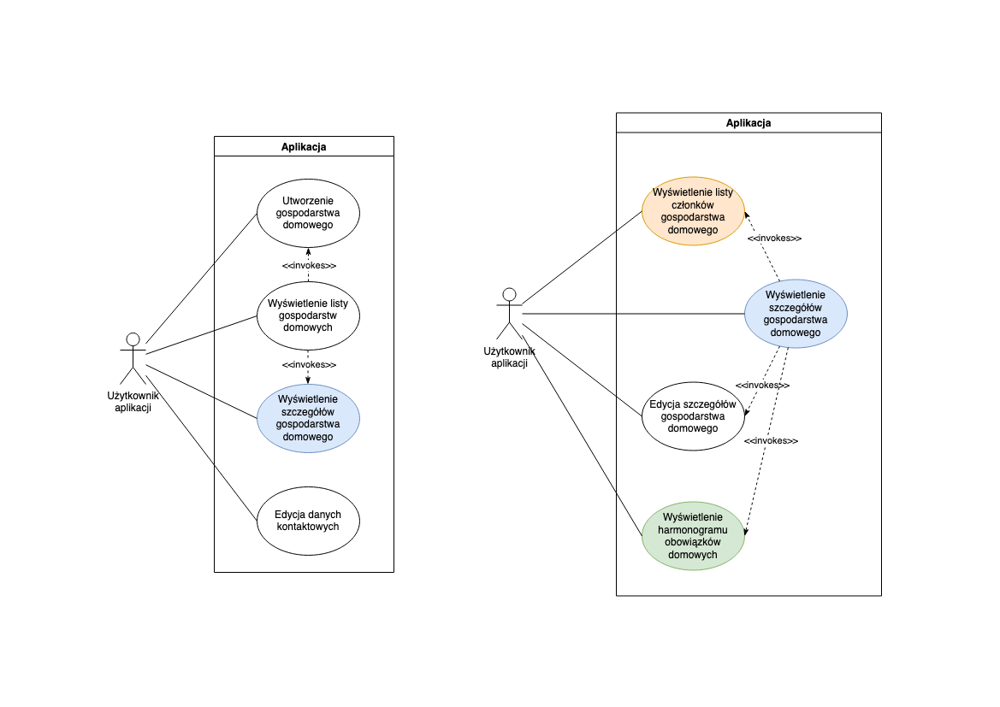
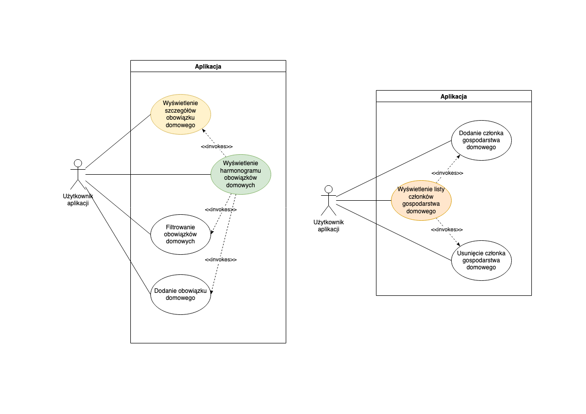
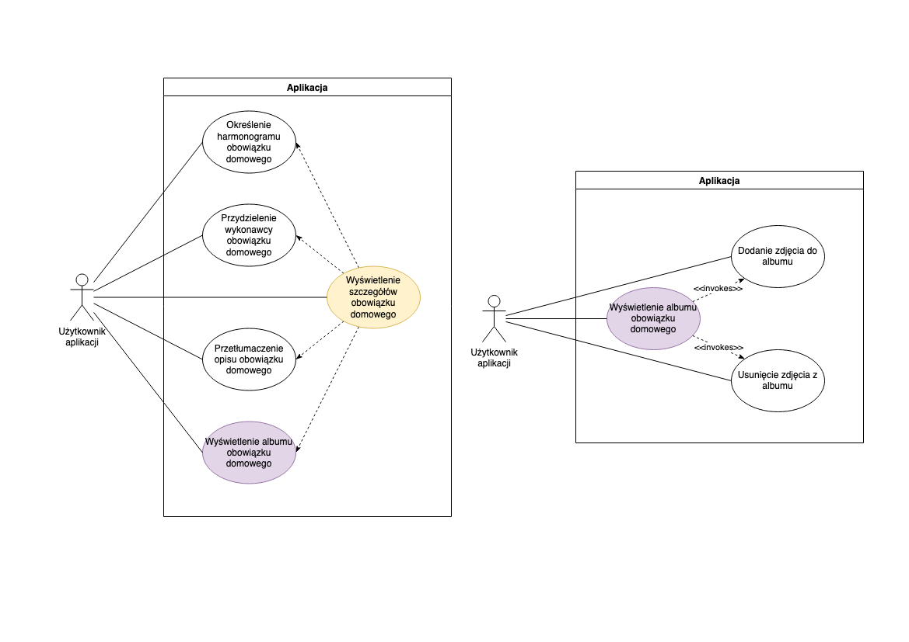
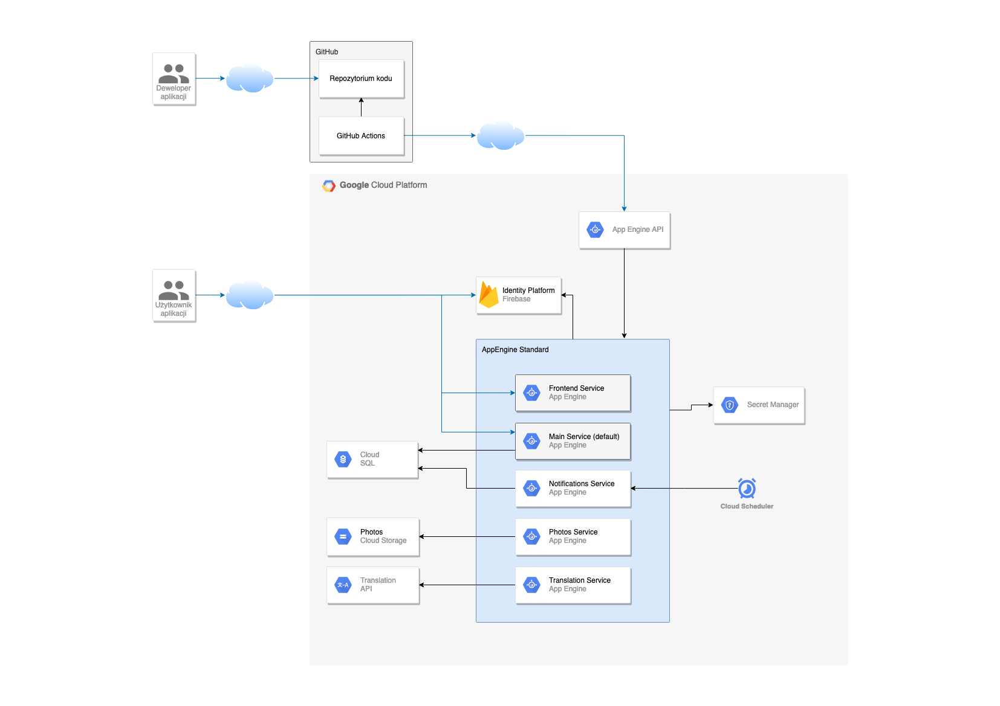

# Household Planner

#### Dokumentacja oraz sprawozdanie projektu z przedmiotu "Programowanie usług w chmurze"

Łukasz Kamiński, Mateusz Kossakowski, Arkadiusz Michalak, Rafał Pachnia, Ernest Szypuła.

## Wstęp

W ramach projektu zdecydowano się na realizację aplikacji umożliwiającej zarządzanie obowiązkami gospodarstwa domowego.
Aplikację nazwano "Household Planner". Aby pokazać potencjał chmury obliczeniowej, funkcjonalność aplikacji zrealizowano
w całości w oparciu o usługi dostępne w Google Cloud Platform (GCP).

## Przypadki użycia

Aplikacja "Household Planner" służy do zarządzania obowiązakmi domowymi w gospodarstwie użytkownika. Do logowania oraz
rejestracji wykorztywane jest Konto Google.

Pierwszym ekranem widocznym po zalogowaniu jest lista gospodarstw domowych, kto których użytkoenik należy. Z opziomu
listy można przejść do szczegółów gospodarstwa lub utworzyć nowe gospodarstwo domowe.

W aplikacji istnieje również możliwość edycji danych kontaktowych użytkownika.

Z poziomu szczegółów gospodarstwa domowego istnieje możliwość edycji gospodarstwa, wyświetlenia członków gospodarstwa
oraz wyświetlenie harmonogramu (listy) obowiązków domowych.

Harmonogram obowiązków domowych pozwala na filtrowanie obowiązków, dodanie nowego obowiązku oraz oferuje możliwość
przejścia do szczegółów obowiązku domowego.

Lista członków gospodarstwa domowego pozwala na ich wyświetlenie oraz edycję: dodanie i usunięcie.

Szczegóły obowiązku domowego zawierają takie informacje, jak: opis obowiązku oraz osoba przypisana do wykonywania
obowiązku. Opis obowiązku można przetłumaczyć na jeden z oferowanych języków, zaś wykonawcę obowiązku można przydzielić
spośród członków gospodarstwa domowego. Istnieje również możliwość edycji obowiązku (np. jego harmonogramu).

Każdy obowiązek domowy posiada album zdjęć. Zdjęcia można wyświetlić, dodać oraz usunąć.

## Architektura i wykorzystane technologie

Aplikacja została zbudowana w modelu cloud-native z wykorzystaniem usług oferowanych przez chmurę Google Cloud
Platform (GCP). Zdecydowano się na architekturę mikroserwisową realizowaną w usłudze AppEngine Standard.

Logowanie/rejestracja do aplikacji oraz autoryzacja zapytań została zrealizowana przy pomocy Identity Platform.

Front-End aplikacji był serwowany przez dedykowany serwis zwracający dostarczone pliki statyczne.

Back-End aplikacji był złożony z serwisów działających w środowisku uruchomieniowym Python. Wśród serwisów Back-Endowych
wyróżnić można serwis główny (default) odpowiadający za komunikację z aplikacją Front-End oraz serwisy realizujące
fragmenty funkcjonalności, wywoływane przez serwis główny. Wyjątek stanowi serwis odpowiadający za powiadomienia e-mail,
gdyż był on wywoływany cyklicznie przez Cloud Scheduler i nie udostępniał API dla aplikacji Front-End.

Jako relacyjną bazę danych wykorzystano PostgreSQL 13 oferowaną w usłudze Cloud SQL. Dane sekretne
(wrażliwe na ekspozycję) przechowywano w usłudze Secret Manager. Zdjęcia obowiązku domowego przechowywano w dedykowanej
przestrzeni dyskowej Cloud Storage. Do tłumaczenia opisu obowiązku domowego wykorzystano Translation API.

W projekcie wykorzystano automatyzację wdrażania nowych wersji aplikacji za pomocą GitHub Actions. Architekruta chmurowa
została opisana oraz zainicjalizowana za pomocą kodu Terraform.

## Struktura API

TODO: screen ze swaggera

## Sposób realizacji

Projekt został zrealizowany w zespole 5-osobowym. Faza przed implementacją (założenia architektoniczne, przypadki
użycia) była realizowana wspólnymi siłami całego zespołu bez podziału na role.

W fazie implementacji oraz w fazie końcowej członkowie zespołu wybrali określone specjalizacje, jednak pomagali sobie
nawzajem jeśli wystąpiła taka potrzeba.

Podział zadań wyglądał następująco:

* Łukasz Kamiński - Front-End, podział i opis zadań, dokumentacja,
* Mateusz Kossakowski - Back-End (serwis główny),
* Arkadiusz Michalak - Baza danych, film pokazowy,
* Rafał Pachnia - Back-End (serwis główny, serwis do tłumaczeń),
* Ernest Szypuła - Back-End (serwis do zdjęć), infrastruktura Terraform.

## Zaimplementowana funkcjonalność

TODO: screeny z apki

## Wyzwania

Implementacja aplikacji przebiegła bezproblemowo, jednak członkowie zespołu napotkali wyzwania związane z odpowiednim
zabezpieczeniem aplikacji - zarówno pod kątem biznesowym, jak i pod kątem bezpieczeństwa danych.

Wszystkie punkty końcowe aplikacji musiały być zabezpieczone tokenem autoryzacyjnym Identity Platform. W tym celu został
napisany dedykowany middleware. Zaimplementowano również punkt końcowy dedykowany rejestracji lub logowaniu użytkownika-
pozostałe punkty końcowe spodziewały się istnienia użytkownika w bazie i w przeciwnym razie zwracały status 401.

Zapewniono dodatkową walidację punktów końcowych:

* użytkownik niebędący członkiem gospodarstwa domowego nie może uzyskać informacji o tym gospodarstwie,
* nie da się przypisać użytkownika jak wykonawcy obowiązku domowego, jeśli nie jest on członkiem gospodarstwa domowego,
* usunięcie użytkownika z gospodarstwa domowego usuwa przypisanie go do wszystkich obowiązków domowych w tym
  gospodarstwie,
* użytkownik na liście gospodarstw widzi tylko te, do których należy.

Aby wyeliminować niepotrzebnie przechowywane dane, zabezpieczono operacje usuwania:

* przy usuwaniu obowiązku domowego usuwane są wszystkie jego zdjęcia z przestrzeni Cloud Storage,
* przy usuwaniu gospodarstwa domowego usuwane są wszystkie jego obowiązki domowe (zgodnie z opisaną wyżej procedurą)
  oraz wszystkie asocjacje do użytkowników (wszyscy członkowie).

Konieczne było również zabezpieczenie przed sytuacją, w której usuwani są wszyscy członkowie gospodarstwa domowego -
takie gospodarstwo pozostałoby już na zawsze niewidoczne dla żadnego użytkownika. Aby się przed tym zabezpieczyć, osoba
tworząca gospodarstwo jest oznaczana jako jego właściciel. Właściciela gospodarstwa nie można usunąć (nawet on sam nie
może tego zrobić). W ten sposób zawsze istnieje co najmniej jeden użytkownik mający kontrolę nad gospodarstwem.

## Wnioski

Realizacja projektu w oparciu o rozwiązania chmurowe przebiegła szybko i bezproblemowo. Serwisy AppEngine są łatwe we
wdrażaniu oraz umożliwiają rozsądne automatyczne skalowanie. Dzięki podejściu pay-as-you-go zespół nie musiał martwić
się o koszty nieużywanej infrastruktury. Nie było również konieczności szukania maszyn mogących hostować rozwiązania -
cała infrastruktura została wygodnie powołana za pomocą kodu Terraform i jej zmiany są odzwierciedlane w wersjonowanym
kodzie.

Dodatkowe usługi (SSO, Secret Manager, Cloud SQL) dobrze integrują się ze środowiskiem AppEngine i umożliwiają
przyspieszenie implementacji.

## Repozytoria

Projekt był realizowany w repozytoriach dedykowanych przechowywaniu określonych komponentów projektu:

* https://github.com/lukitoki1/household-planner - Back-End aplikacji
* https://github.com/lukitoki1/household-planner-frontend - Front-End aplikacji
* https://github.com/ErnestSzypula/household-planner-terraform - Terraform infrastruktury aplikacji

