# Household Planner

Repozytorium Back-End projektu "Household Planner"

## Repozytoria

Projekt był realizowany w repozytoriach dedykowanych przechowywaniu określonych komponentów projektu:

* https://github.com/lukitoki1/household-planner - Back-End aplikacji
* https://github.com/lukitoki1/household-planner-frontend - Front-End aplikacji
* https://github.com/ErnestSzypula/household-planner-terraform - Terraform infrastruktury aplikacji

# Dokumentacja i sprawozdanie

#### Dokumentacja i sprawozdanie projektu z przedmiotu "Programowanie usług w chmurze"

Łukasz Kamiński, Mateusz Kossakowski, Arkadiusz Michalak, Rafał Pachnia, Ernest Szypuła.

## Wstęp

W ramach projektu zdecydowano się na realizację aplikacji umożliwiającej zarządzanie obowiązkami gospodarstwa domowego.
Aplikację nazwano "Household Planner". Aby pokazać potencjał chmury obliczeniowej, funkcjonalność aplikacji zrealizowano
w całości w oparciu o usługi dostępne w Google Cloud Platform (GCP).

## Przypadki użycia

Aplikacja "Household Planner" służy do zarządzania obowiązakmi domowymi w gospodarstwie użytkownika. Do logowania oraz
rejestracji wykorzystywane jest Konto Google.

Pierwszym ekranem widocznym po zalogowaniu jest lista gospodarstw domowych, kto których użytkoenik należy. Z opziomu
listy można przejść do szczegółów gospodarstwa lub utworzyć nowe gospodarstwo domowe.

W aplikacji istnieje również możliwość edycji danych kontaktowych użytkownika.

Z poziomu szczegółów gospodarstwa domowego istnieje możliwość edycji gospodarstwa, wyświetlenia członków gospodarstwa
oraz wyświetlenie harmonogramu (listy) obowiązków domowych.

Harmonogram obowiązków domowych pozwala na filtrowanie obowiązków, dodanie nowego obowiązku oraz oferuje możliwość
przejścia do szczegółów obowiązku domowego.

Lista członków gospodarstwa domowego pozwala na ich wyświetlenie oraz edycję: dodanie i usunięcie.

Szczegóły obowiązku domowego zawierają takie informacje, jak: opis obowiązku oraz osoba przypisana do wykonywania
obowiązku. Opis obowiązku można przetłumaczyć na jeden z oferowanych języków, zaś wykonawcę obowiązku można przydzielić
spośród członków gospodarstwa domowego. Istnieje również możliwość edycji obowiązku (np. jego harmonogramu).

Każdy obowiązek domowy posiada album zdjęć. Zdjęcia można wyświetlić, dodać oraz usunąć.

Oprócz funkcjonalności zaprezentowanej na diagramach przypadków użycia, aplikacja posiada funkcję powiadamiania o
nadchodzących obowiązkach domowych przypisanych do użytkownika poprzez powiadomienia e-mail.

## Architektura i wykorzystane technologie

Aplikacja została zbudowana w modelu cloud-native z wykorzystaniem usług oferowanych przez chmurę Google Cloud
Platform (GCP). Zdecydowano się na architekturę mikroserwisową realizowaną w usłudze AppEngine Standard.

Logowanie/rejestracja do aplikacji oraz autoryzacja zapytań została zrealizowana przy pomocy Identity Platform.

Front-End aplikacji był serwowany przez dedykowany serwis zwracający dostarczone pliki statyczne.

Back-End aplikacji był złożony z serwisów działających w środowisku uruchomieniowym Python. Wśród serwisów Back-Endowych
wyróżnić można serwis główny (default) odpowiadający za komunikację z aplikacją Front-End oraz serwisy realizujące
fragmenty funkcjonalności (obsługa zdjęć, obsługa tłumaczeń), wywoływane przez serwis główny. Wyjątek stanowi serwis
odpowiadający za powiadomienia e-mail, gdyż był on wywoływany cyklicznie przez Cloud Scheduler i nie udostępniał API dla
aplikacji Front-End.

Jako relacyjną bazę danych wykorzystano PostgreSQL 13 oferowaną w usłudze Cloud SQL. Dane sekretne
(wrażliwe na ekspozycję) przechowywano w usłudze Secret Manager. Zdjęcia obowiązku domowego przechowywano w dedykowanej
przestrzeni dyskowej Cloud Storage. Do tłumaczenia opisu obowiązku domowego wykorzystano Translation API.

W projekcie wykorzystano automatyzację wdrażania nowych wersji aplikacji za pomocą GitHub Actions. Architektura chmurowa
została opisana oraz zainicjalizowana za pomocą kodu Terraform.

## Sposób realizacji

Projekt został zrealizowany w zespole 5-osobowym. Faza przed implementacją (założenia architektoniczne, przypadki
użycia) była realizowana wspólnymi siłami całego zespołu bez podziału na role.

W fazie implementacji oraz w fazie końcowej członkowie zespołu wybrali określone specjalizacje, jednak pomagali sobie
nawzajem jeśli wystąpiła taka potrzeba.

Podział zadań wyglądał następująco:

* Łukasz Kamiński - Front-End, podział i opis zadań, dokumentacja,
* Mateusz Kossakowski - Back-End (serwis główny),
* Arkadiusz Michalak - Baza danych, film pokazowy,
* Rafał Pachnia - Back-End (serwis główny, serwis tłumaczeń),
* Ernest Szypuła - Back-End (serwis zdjęć, serwis powiadomień), infrastruktura Terraform.

## Zaimplementowana funkcjonalność

W toku prac zespołu udało się zaimplementować całą zakładaną funkcjonalność aplikacji. Poniżej przedstawiono
poszczególne elementy interfeksu użytkownika wraz z opisem działania.

<kbd>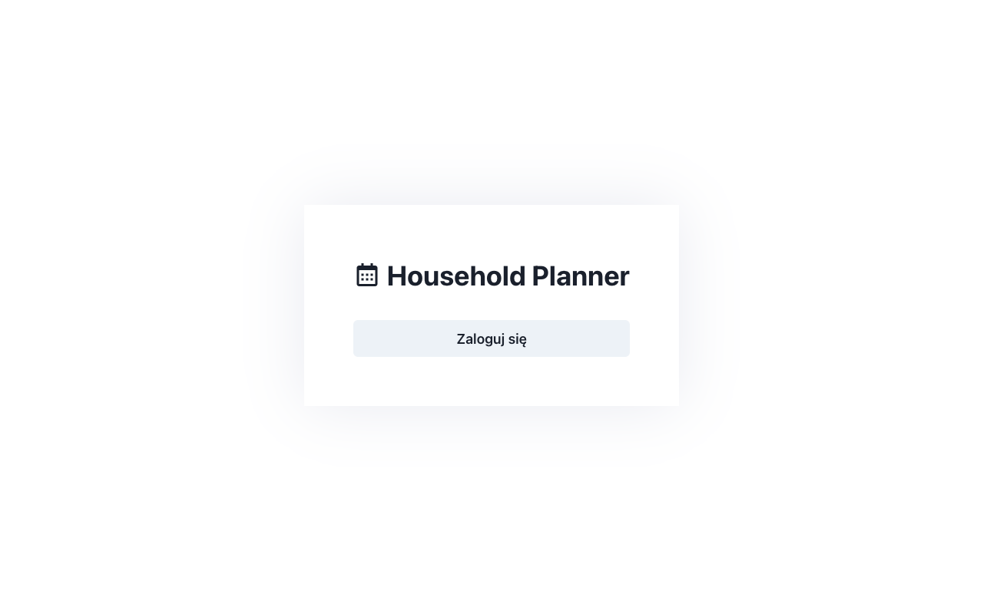</kbd>

Użytkownik jest witany ekranem umożliwiającym logowanie lub rejestrację. Po naciśnięciu przycisku "Zaloguj się"
użytkownik przenoszony jest do ekranu logowania Kontem Google.

<kbd>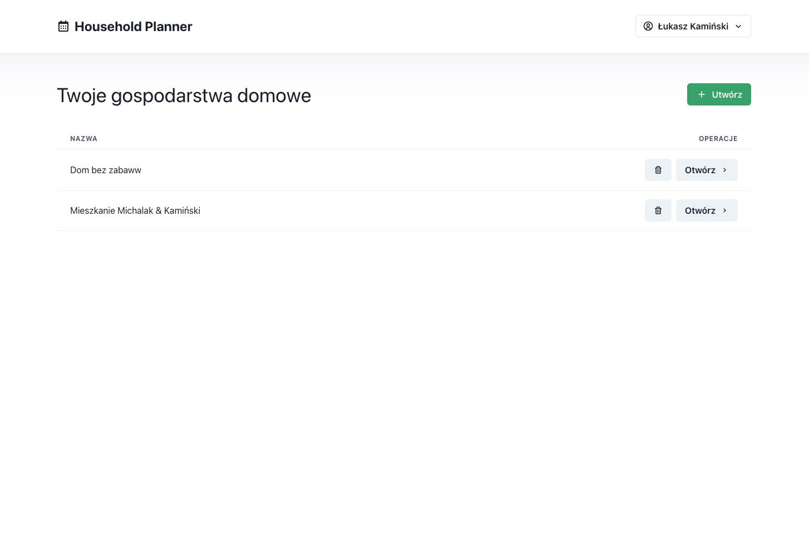</kbd>

Pierwszy ekran widoczny po pomyślnym zalogowaniu (lub pomyślnej rejestracji) to lista gospodarstw domowych, których
użytkownik jest członkiem. Z poziomu ekranu można utworzyć nowe gospodarstwo domowe, usunąć gospodarstwo lub przejść do
ekranu szcegółów gospodarstwa.

<kbd>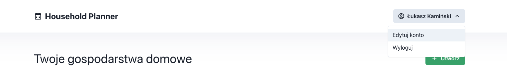</kbd>

W całej aplikacji dostępny jest górny pasek nawigacyjny oferujący możliwość wylogowania z aplikacji lub przejścia do
ekranu edycji danych kontaktowych.

<kbd>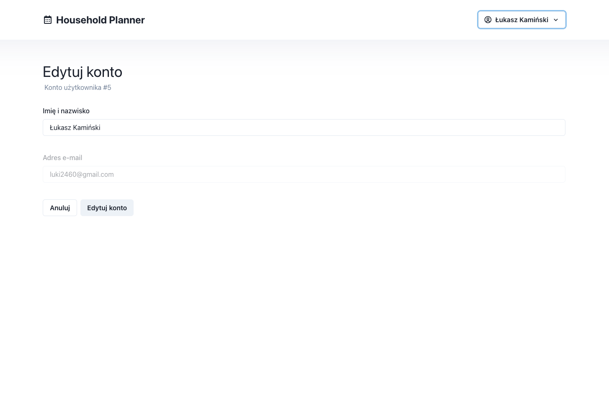</kbd>

Ekran edycji danych kontaktowych pozwala na wyświetlenie adresu e-mail użytkownika (można w ten sposób np. sprawdzić, na
jaki adres e-mail będą przychodziły powiadomienia) oraz umożliwia zmianę imienia i nazwiska użytkownika. Po rejestracji
użytkownikowi przypisywane jest imię i nazwisko z Konta Google. Imię i nazwisko widoczne jest w różnych miejscach
interfejsu użytkownika oraz w komunikacji e-mail.

<kbd>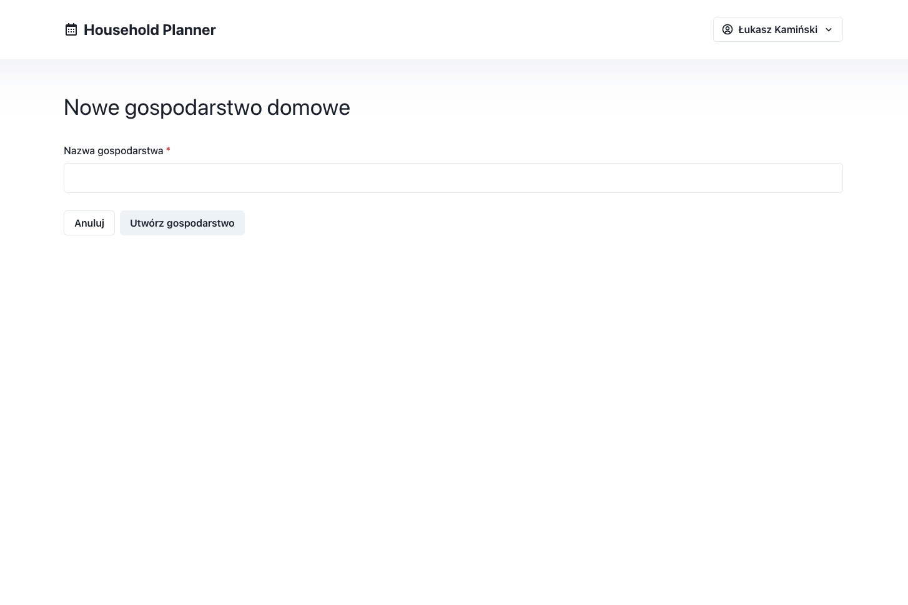</kbd>

Kreator gospodarstwa domowego ogranicza się do podania nazwy nowego gospodarstwa domowego - pozostałe atrybuty
gospodarstwa ustawia się z poziomu szczegółów gospodarstwa. Użytkownik tworzący gospodarstwo staje się jego
właścicielem: właściciela gospodarstwa nie można usunąć z członków gospodarstwa.

<kbd>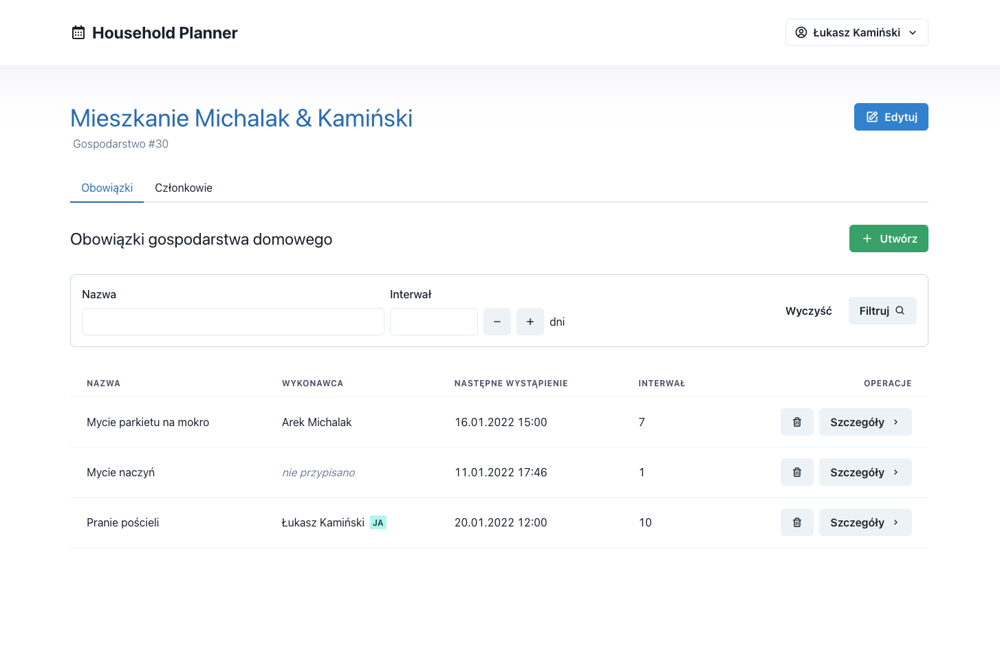</kbd>

Po przejściu do szczegółów gospodarstwa widoczna jest nazwa oraz ID gospodarstwa domowego. Domyślnie otwarta jest
karta "Obowiązki" prezentująca listę obowiązków domowych. Każdy obowiązek domowy opatrzony jest: nazwą, wykonawcą (jeśli
jest przypisany), datą następnego wystąpienia oraz interwałem. Z poziomu listy obowiązków istnieje możliwość usunięcia
obowiązku oraz wyświetlenia szczegółów obowiązku.

<kbd>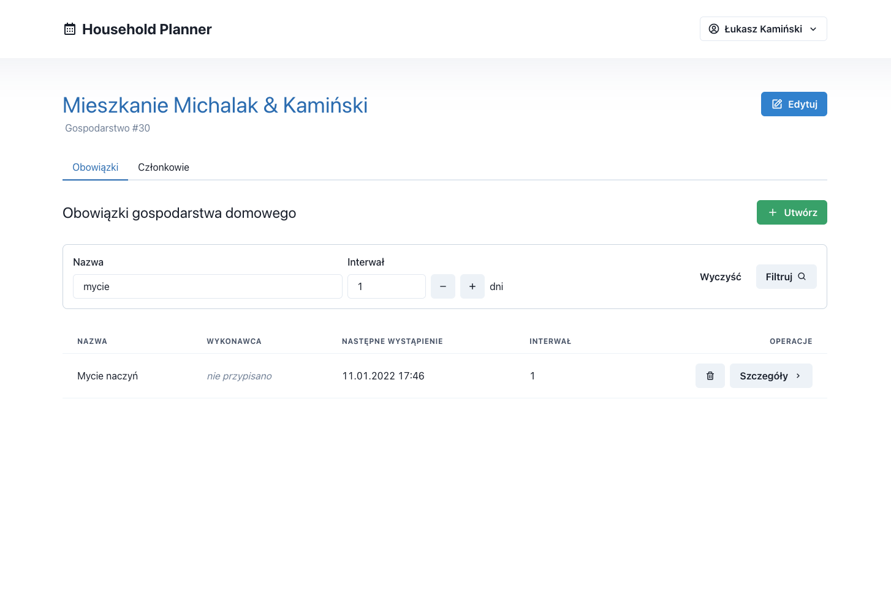</kbd>

Na liście obowiązków dostępne jest również filtrowanie przez nazwę oraz interwał. Przycisk "Wyczyść" powoduje usunięcie
parametrów filtrujących i pokazanie pełnej listy obowiązków.

<kbd>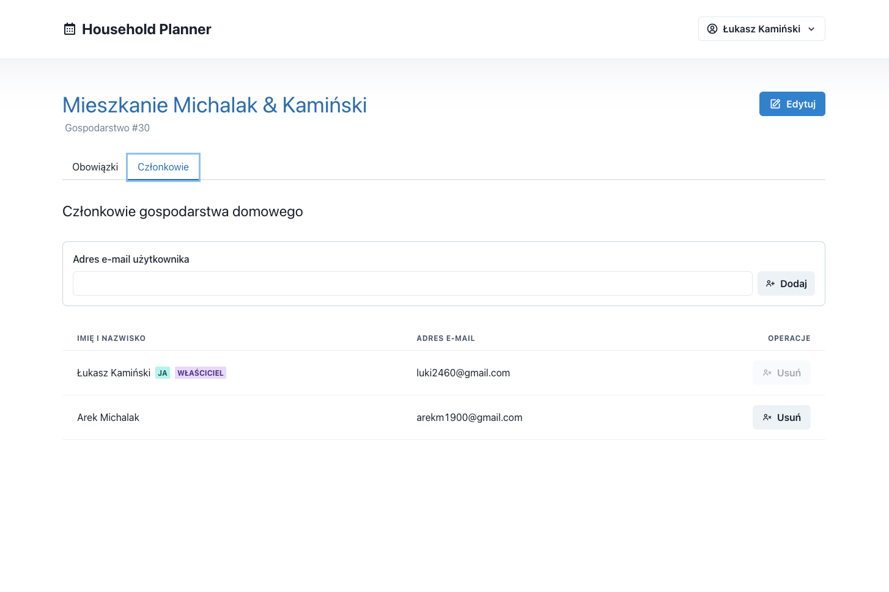</kbd>

Wśród członków gospodarstwa domowego wyróżniony jest jego właściciel: wiersz jest poatrzony etykietą, a przycisk do
usuwania członka gospodarstwa jest nieaktywny. Usunięcie samego siebie z gospodarstwa podowuje przeniesienie na ekran
listy gospodarstw domowych.

<kbd>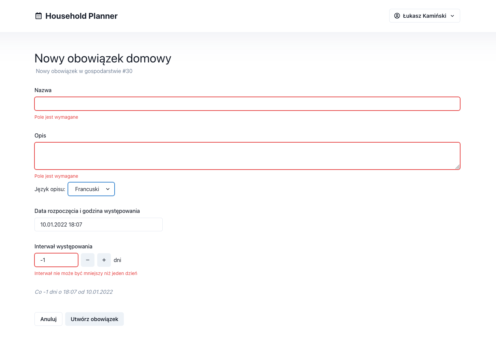</kbd>

Z poziomu listy obowiązków można również wywołać formularz dodawania obowiązku domowego. Wartości umieszczane w tym
formularzu (jak i w pozostałych formularzach w aplikacji) podlegają walidacji po stronie Front-End oraz Back-End.

<kbd>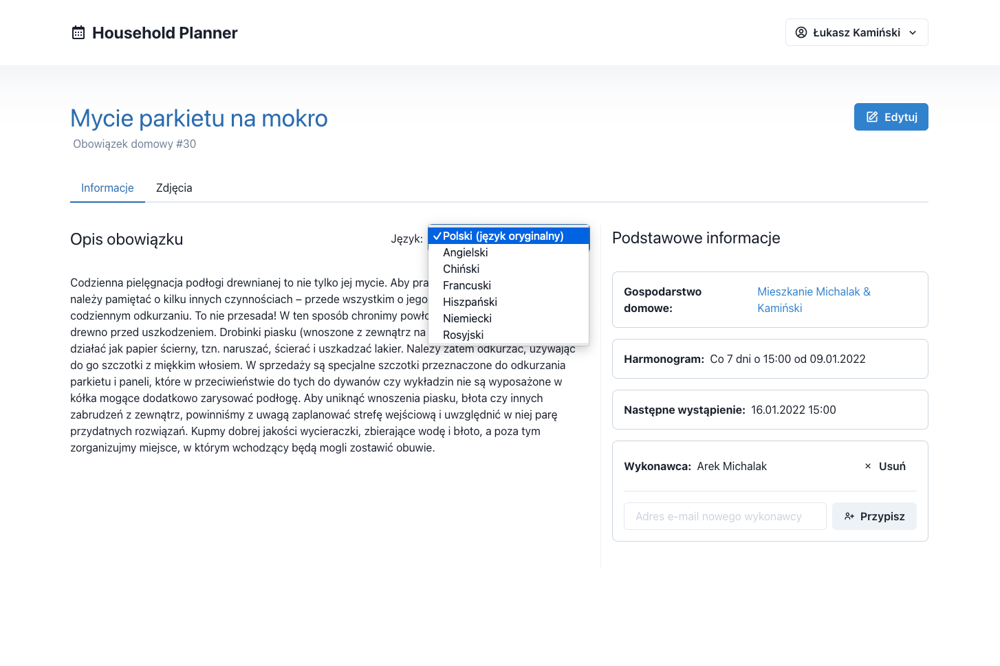</kbd>

Ekran szczegółów obowiązku domowego przedstawia podstawowe informacje o obowiązku: ID, nazwę, opis, wykonawcę,
harmonogram i następne wystąpienie. Na ekranie dostępny jest odnośnik do gospodarstwa domowego, którego dotyczy
obowiązek. Wykonawcę obowiązku można przypisać, usunąć (wtedy obowiązek nie będzie miał wykonawcy) lub nadpisać.

<kbd>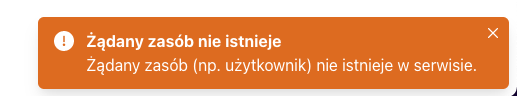</kbd>

Każde pole odnoszące się do użytkownika jest walidowane pod kątem istnienia użytkownika w bazie danych aplikacji.

<kbd>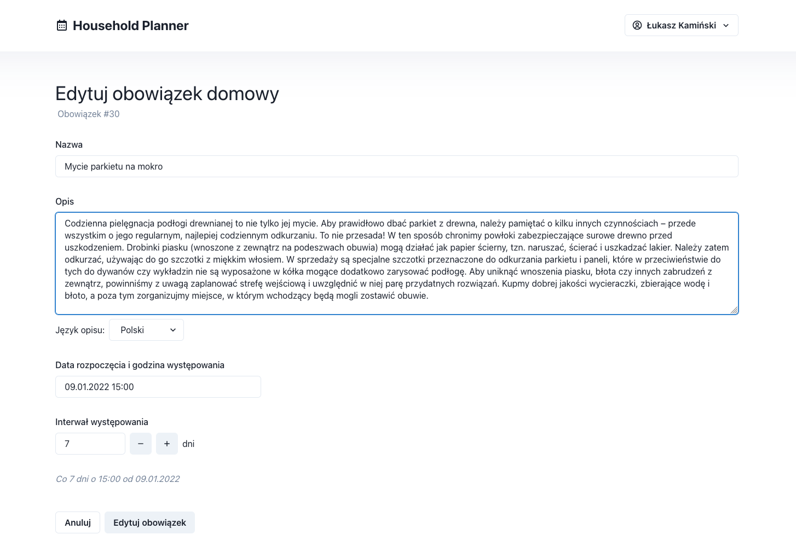</kbd>

Z ekranu szczegółów istnieje możliwość przejścia do edycji obowiązku domowego. Formularz jest wypełniany dotychczasowymi
wartościami atrybutów obowiązku.

<kbd>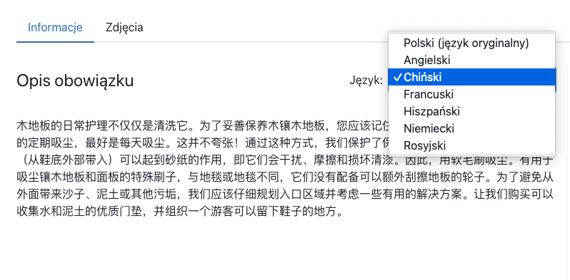</kbd>

Opis obowiązku można przetłumaczyć na jeden z dostępnych języków.

<kbd>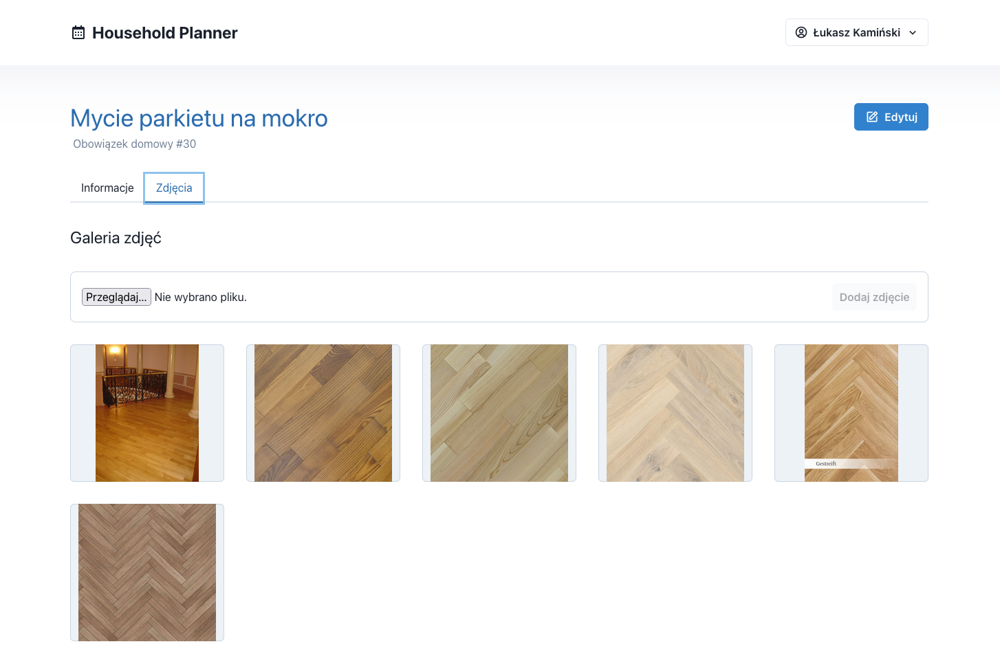</kbd>

W ramach szczegółów obowiązku domowego dostępna jest również galeria obowiązku w postaci siatki zdjęć oraz komponentu
umożliwiającego dodanie nowego zdjęcia. Akceptowane są wyłącznie pliki graficzne.

<kbd>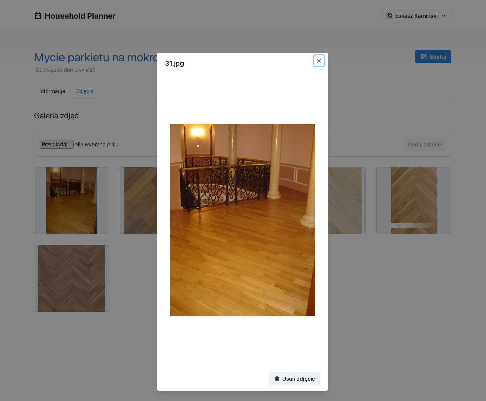</kbd>

Po wybraniu żądanego zdjęcia otwiera się jego podgląd. Z tego poziomu możliwe jest usunięcie zdjęcia z galerii.

<kbd>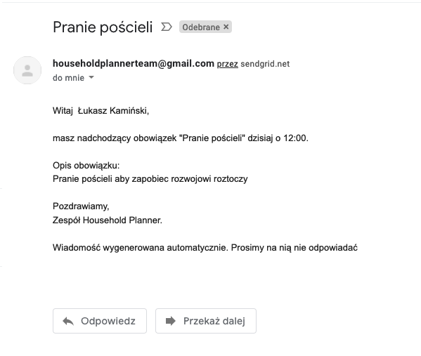</kbd>

Aby użytkownicy nie zapomnieli o obowiązkach domowych, aplikacja wysyła komunikaty e-mail o nadchodzących obowiązkach.
Komunikacja kierowana jest na adres e-mail konta użytkownika i następuje max. 1h przed planowanym terminem rozpoczęcia
obowiązku. Nadchodzące obowiązki użytkownika są sprawdzane przez serwis powiadomień co 5 minut.

## Wyzwania

Implementacja aplikacji przebiegła bezproblemowo, jednak członkowie zespołu napotkali wyzwania związane z odpowiednim
zabezpieczeniem aplikacji - zarówno pod kątem biznesowym, jak i pod kątem bezpieczeństwa danych.

Wszystkie punkty końcowe aplikacji musiały być zabezpieczone tokenem autoryzacyjnym Identity Platform. W tym celu został
napisany dedykowany middleware. Zaimplementowano również punkt końcowy dedykowany rejestracji lub logowaniu użytkownika-
pozostałe punkty końcowe spodziewały się istnienia użytkownika w bazie i w przeciwnym razie zwracały status 401.

Zapewniono dodatkową walidację punktów końcowych:

* użytkownik niebędący członkiem gospodarstwa domowego nie może uzyskać informacji o tym gospodarstwie,
* nie da się przypisać użytkownika jako wykonawcy obowiązku domowego, jeśli nie jest on członkiem gospodarstwa domowego,
* usunięcie użytkownika z gospodarstwa domowego usuwa przypisanie go do wszystkich obowiązków domowych w tym
  gospodarstwie,
* użytkownik na liście gospodarstw widzi tylko te, do których należy.

Aby wyeliminować niepotrzebnie przechowywane dane, zabezpieczono operacje usuwania:

* przy usuwaniu obowiązku domowego usuwane są wszystkie jego zdjęcia z przestrzeni Cloud Storage,
* przy usuwaniu gospodarstwa domowego usuwane są wszystkie jego obowiązki domowe (zgodnie z opisaną wyżej procedurą)
  oraz wszystkie asocjacje do użytkowników (wszyscy członkowie).

Konieczne było również zabezpieczenie przed sytuacją, w której usuwani są wszyscy członkowie gospodarstwa domowego -
takie gospodarstwo pozostałoby już na zawsze niewidoczne dla żadnego użytkownika. Aby się przed tym zabezpieczyć, osoba
tworząca gospodarstwo jest oznaczana jako jego właściciel. Właściciela gospodarstwa nie można usunąć (nawet on sam nie
może tego zrobić). W ten sposób zawsze istnieje co najmniej jeden użytkownik mający kontrolę nad gospodarstwem.

## Wnioski

Realizacja projektu w oparciu o rozwiązania chmurowe przebiegła szybko i bezproblemowo. Udało się zaimplementować całą
założoną funkcjonalność.

Serwisy AppEngine są łatwe we wdrażaniu oraz umożliwiają rozsądne automatyczne skalowanie. Dzięki podejściu
pay-as-you-go zespół nie musiał martwić się o koszty nieużywanej infrastruktury. Nie było również konieczności szukania
maszyn mogących hostować rozwiązania - cała infrastruktura została wygodnie powołana za pomocą Terraform, a zmiany są na
bieżąco odzwierciedlane w wersjonowanym kodzie. Dodatkowe usługi (SSO, Secret Manager, Cloud SQL) dobrze integrują się
ze środowiskiem AppEngine i umożliwiają jeszcze wygodniejszą oraz jeszcze szybszą implementację.

Praca zespołowa przebiegła sprawnie dzięki bieżącej organizacji pracy na podstawie tablicy zadań.

## Dodatkowe informacje

### Struktura API

Zaprezentowane zrzuty ekranu pochodzą z narzędzia Swagger.

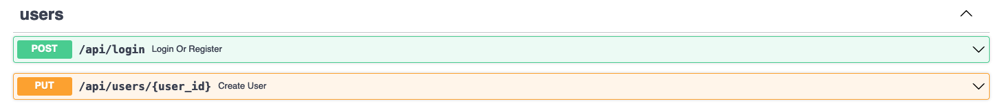

Grupa punktów końcowych odpowiedzialna za rejestrację i logowanie użytkownika, a także za zmianę jego danych
kontaktowych (imię i nazwisko).

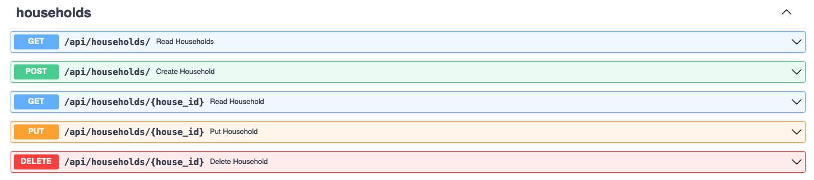

Grupa punktów końcowych obsługująca gospodarstwa domowe. Umożliwia tworzenie, edytowanie i usuwanie gospodarstwa, a
także pobieranie listy gospodarstw użytkownika oraz pubieranie szczegółów gospodarstwa.

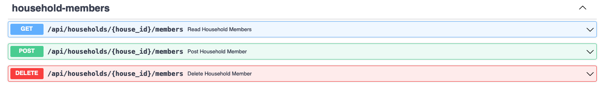

Punkty końcowe umożliwiające zarządzanie członkami gospodarstwa: pobieranie listy, dodawanie, usuwanie.

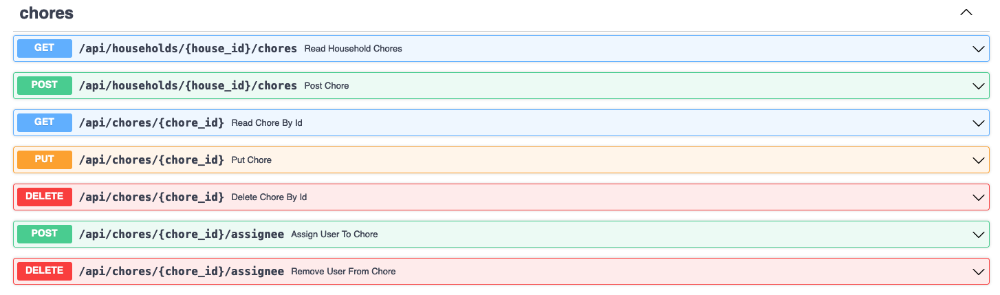

Punkty końcowe obsługujące obowiązki domowe. Umożliwiają pobranie listy obowiązków dla gospodarstwa,
utworzenie/edycję/usunięcie obowiązku, pobranie szczegółów obowiązku, a także przypisanie oraz usunięcie przypisania
użytkownika.

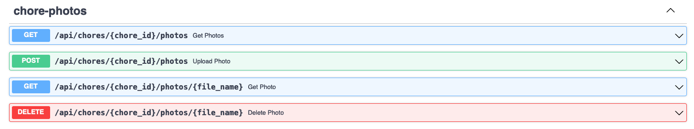

Grupa punktów końcowych odpowiadających za galerię zdjęć obowiązku domowego. Jedno zdjęcie reprezentowane jest przez
obiekt zawierający nazwę zdjęcia oraz podpisany URL do zdjęcia z krótkim czasem życia. Phnkty końcowe umożliwiają
pobranie listy zdjęć, pobranie/usunięcie zdjęcia oraz umieszczenie nowego zdjęcia.

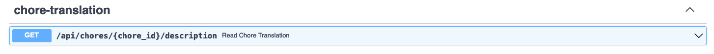

Punkt końcowy odpowiadający za tłumaczenie opisu obowiązku domowego. Jeśli żądanie dotyczy opisu obowiązku w języku
oryginalnym, zwraca oryginalny opis (pomija tłumaczenie).

